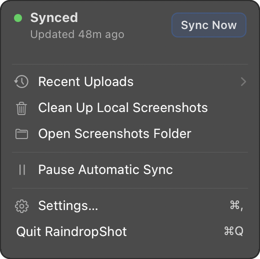
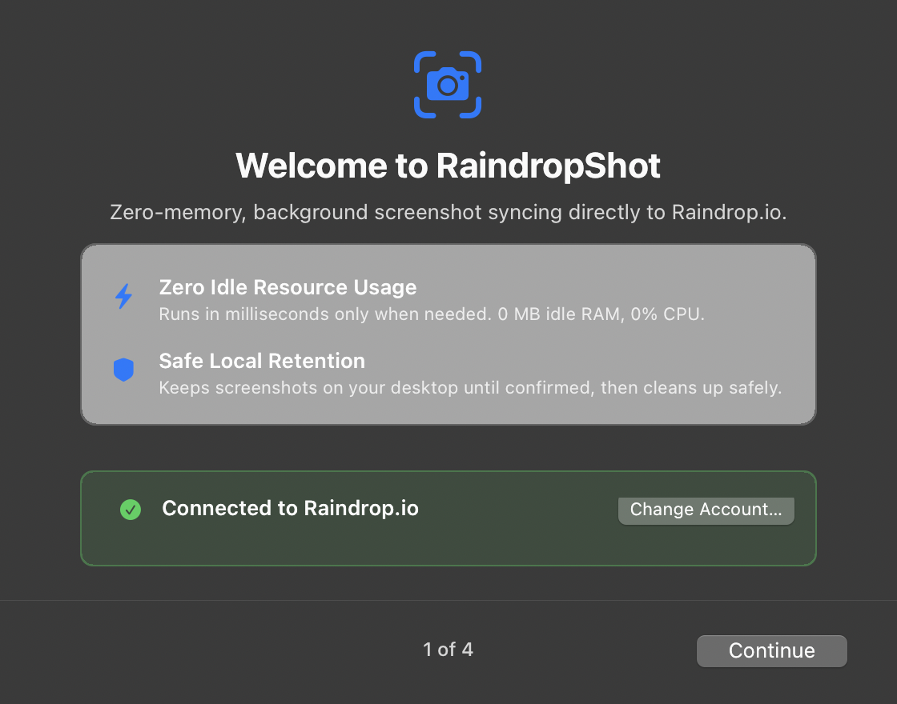
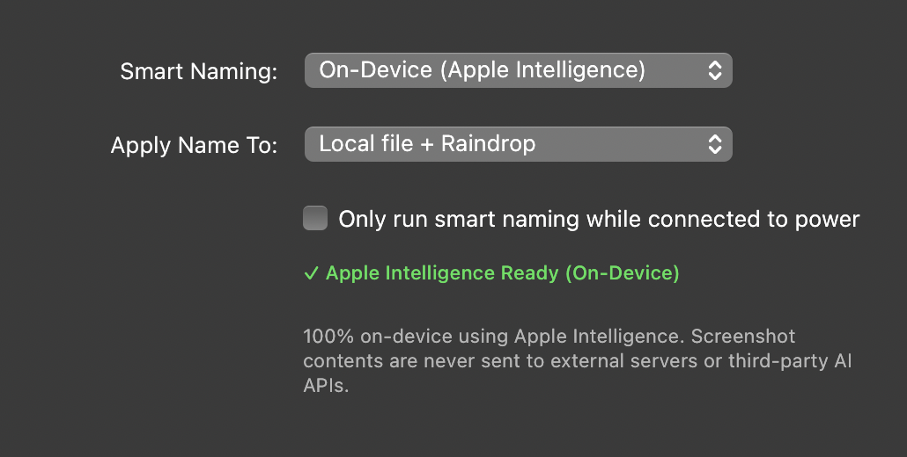
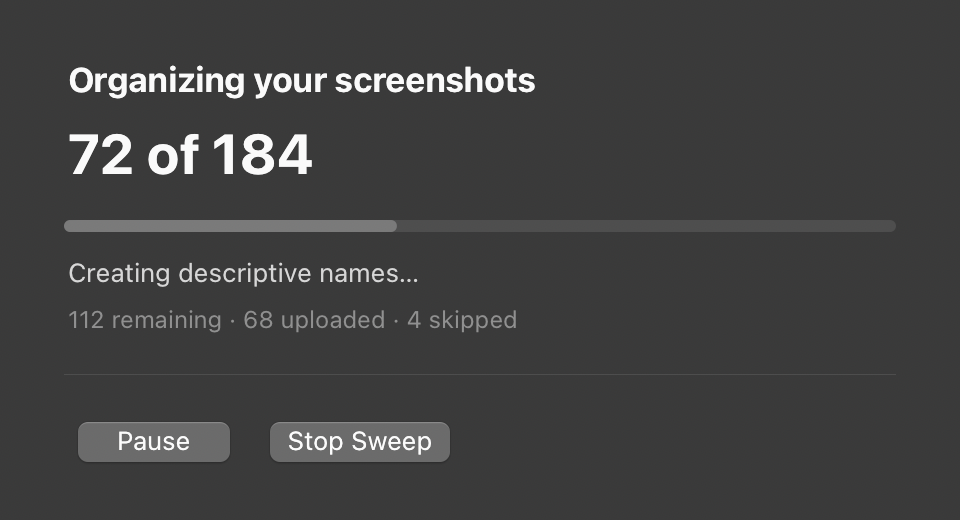

<p align="center">
  
</p>

<h1 align="center">RaindropShot</h1>

<p align="center">
  <b>A lightweight, privacy-first native macOS utility that automatically organizes, smart-names, and uploads screenshots to Raindrop.io.</b><br>
  Built with obsessive focus on zero idle CPU, low memory footprint, and native macOS human interface standards.
</p>

<p align="center">
  
  
  
  
  
  
  
</p>

---

## 🌟 Key Features

- ⚡ **Zero-Idle Architecture**: Periodic background worker via macOS `launchd` runs in ~10 ms, uses ~3 MB peak RAM, and **exits immediately (0.0 MB idle RAM)**.
- 🎯 **0.0% Idle CPU**: Native AppKit menu bar controller wakes only on user interaction or Darwin kernel notifications. Zero polling loops.
- 🧠 **On-Device Smart Screenshot Naming**: Multimodal on-device naming powered by **Apple Foundation Models** (with Vision OCR heuristic fallback). Generates concise, descriptive filenames like `github-raindrop-worker-code.png` instead of `Screenshot 2026-10-08 at 1.03.42 PM.png`.
- 🔒 **100% Privacy-Preserving**: No screenshots or image data are ever sent to third-party AI APIs. Processing is strictly local and battery-aware.
- 🧹 **Backlog "Sweep"**: Effortlessly organizes and uploads historical screenshots that existed before installing the app through a clean, privacy-focused native progress window.
- 🔗 **Public Shareable Link & Auto-Copy**: Automatically copies a shareable Raindrop link to your clipboard when a screenshot is uploaded, or copy it with one click from the menu bar.
- 🔄 **Decoupled Lifecycle**: Upload timing is decoupled from retention and local cleanup. Screenshots remain safe on disk for your chosen duration before moving to Trash or being kept.
- 🔐 **Native Keychain Integration**: OAuth tokens are stored in the macOS Keychain (`com.tejxv.RaindropShot.token`). No plaintext `.env` secrets.
- 🔔 **Actionable Notifications**: Native macOS UserNotifications with direct **Show in Finder**, **Clean Up Now**, and **Sign In** buttons.

---

## 📸 Visual Showcase

<table align="center">
  <tr>
    <td align="center"><b>Clean Menu Dropdown</b></td>
    <td align="center"><b>Onboarding Wizard</b></td>
  </tr>
  <tr>
    <td></td>
    <td></td>
  </tr>
  <tr>
    <td align="center"><b>Smart Naming Settings</b></td>
    <td align="center"><b>Backlog Sweep Progress</b></td>
  </tr>
  <tr>
    <td></td>
    <td></td>
  </tr>
</table>

---

## ⚡ Architecture & Resource Profile

> **"When nothing needs to happen, essentially nothing should be running."**

Unlike legacy screenshot sync daemons that run heavy Node.js or Electron runtimes with persistent file watchers, RaindropShot is engineered as a clean two-tier native system:

```
┌────────────────────────────────────────────────────────┐
│ macOS launchd (Periodic Timer: 1m / 5m / 15m / 30m / 1h)│
└──────────────────────────┬─────────────────────────────┘
                           │ triggers
                           ▼
┌────────────────────────────────────────────────────────┐
│           Headless Worker (RaindropShotWorker)          │
│   • Scans screenshot folder                            │
│   • On-device Apple Foundation Models smart naming     │
│   • Streams file to Raindrop API via PUT /raindrop/file│
│   • Retains local file for configured duration         │
│   • Enqueues actionable notifications to outbox        │
│   • Updates atomic state and EXITS (~10ms runtime)     │
└──────────────────────────┬─────────────────────────────┘
                           │ posts Darwin notification
                           ▼
┌────────────────────────────────────────────────────────┐
│           Menu Bar Controller (RaindropShot.app)        │
│   • Pure AppKit (NSStatusItem, NSWindow)               │
│   • 0.0% CPU when idle (verified via /usr/bin/sample)   │
│   • Only ~3.2 MB dirty heap footprint                  │
│   • Drains notification outbox on wakeup               │
│   • Quitting the menu bar app DOES NOT stop sync!       │
└────────────────────────────────────────────────────────┘
```

### Measured Resource Benchmarks

| Metric | RaindropShot | Legacy Node.js Daemon | Typical Electron App |
| :--- | :--- | :--- | :--- |
| **Worker Idle RAM** | **0.0 MB** (Terminates) | ~70 – 120 MB | ~150 – 300 MB |
| **Worker Peak RAM** | **~3.0 MB** | ~120 MB | ~250 MB |
| **Worker Runtime** | **10 – 30 ms** | Always running | Always running |
| **Menu App Idle CPU** | **0.0%** (mach trap wait) | N/A (no UI) | 1.0 – 5.0% |
| **App Dirty Heap** | **~3.2 MB** | ~90 MB | ~180 MB |
| **Network per Upload** | **1 request** (Streamed) | 3 requests (Buffered) | 2–4 requests |

---

## 🧠 On-Device Smart Screenshot Naming

Say goodbye to cryptic filenames like `Screenshot 2026-10-08 at 1.03.42 PM.png`.

RaindropShot uses **Apple's Foundation Models framework** to inspect newly captured screenshots locally and generate concise, descriptive filenames:

* **Example outputs:**
  * `borrowbox-generator-rental-dashboard.png`
  * `revenuecat-trial-customer-details.png`
  * `github-raindrop-worker-code.png`
  * `figma-ios-settings-screen.png`
* **Naming Rules:**
  * 3–6 concise, meaningful words in lowercase kebab-case.
  * Preserves proper product and tool names (`figma`, `github`, `xcode`, `raindrop`, etc.).
  * Omits generic filler words (`screenshot`, `image`, `screen`, `window`).
  * Never overwrites existing files (uses collision suffixes: `-2`, `-3`).
* **Raindrop Metadata:** Automatically populates the uploaded Raindrop bookmark title and excerpt using the generated intelligence.
* **Safety & Resilience:** If Foundation Models are unavailable, downloading, or if the device is on low battery, the system gracefully falls back to Vision OCR heuristics or the original filename. **Smart naming never blocks synchronization.**

---

## 🧹 Backlog Sweep

When you first install RaindropShot, you probably have dozens (or hundreds) of existing screenshots on your Desktop:

* **1-Click Backlog Discovery**: Instantly detects unmanaged screenshots in your configured folder.
* **Privacy-Respecting UI**: Progress is displayed via a native macOS visual effect window with percentage, file count, and cancel control—**never displaying thumbnails or private content on screen**.
* **Canonical Pipeline**: Sweep reuses the exact same smart-naming, deduplication, upload streaming, and retention pipeline as real-time captures.

---

## 🔄 The Screenshot Lifecycle

RaindropShot decouples upload timing from local file cleanup:

1. **Capture**: A screenshot is saved to your screenshot directory.
2. **Detection & Stability**: The worker checks file stability (ensures the file has finished writing before touching it).
3. **Smart Naming**: Generates descriptive metadata locally on-device and renames the file safely.
4. **Upload Execution**: Upload delay elapses (Immediate, 5m, 15m, 30m, 1h, or manual). File is streamed to Raindrop.
5. **Retention Period**: Confirmed upload response received. The file remains local for the configured duration (5m, 15m, 1h, 24h, 7d, forever).
6. **Due Local Cleanup**: After retention expires, the file is moved to Trash (default), deleted, or kept permanently.
   > **Note:** If you manually edit a screenshot locally after upload, RaindropShot detects the modification and marks it as *kept*, ensuring your work is never deleted.

---

## 🛠️ Building & Installation

### Requirements
- macOS 13.0 (Ventura) or newer (Apple Silicon or Intel)
- Xcode 14+ or Command Line Tools (`xcode-select --install`)

### 1. Build
Clone the repository and build the release app:

```bash
git clone https://github.com/tejxv/Raindrop-Screenshot-Automation.git
cd Raindrop-Screenshot-Automation
make app
```

This compiles optimized release binaries and creates `RaindropShot.app` code-signed with ad-hoc signatures.

### 2. Launch & Onboarding
Launch the app:

```bash
open RaindropShot.app
```

On first launch, RaindropShot guides you through a streamlined onboarding flow:
1. **Welcome**: Quick explanation of the zero-memory philosophy.
2. **1-Click Connect**: Connect via browser OAuth or paste an API access token.
3. **Screenshot Folder**: Select your screenshot directory (auto-detects macOS screencapture defaults).
4. **Preferences**: Configure upload delay, retention duration, and smart naming.
5. **Sweep Backlog**: Optionally organize existing historical screenshots.

---

## 💻 CLI & Power User Commands

The compiled worker binary can be executed directly from terminal or automated in your own scripts:

```bash
# Dry run: view what would be named, uploaded, and cleaned without touching files
./RaindropShot.app/Contents/MacOS/RaindropShotWorker --dry-run

# Trigger an immediate upload pass:
./RaindropShot.app/Contents/MacOS/RaindropShotWorker --upload-now

# Immediately clean up screenshots whose upload is confirmed:
./RaindropShot.app/Contents/MacOS/RaindropShotWorker --clean-now

# Run a backlog sweep from terminal:
./RaindropShot.app/Contents/MacOS/RaindropShotWorker --sweep

# View current worker state and health snapshot:
./RaindropShot.app/Contents/MacOS/RaindropShotWorker --status
```

---

## 🧪 Testing

The test suite covers state transitions, smart naming sanitization, backlog sweep idempotency, duplicate prevention, and retry backoff:

```bash
swift test
```

*Results: 43 unit and integration tests passing in ~1.6 seconds.*

---

## 🚚 Migrating from the Old Node.js Daemon

If you ran the previous Node.js daemon version:
1. Open **Settings** > **Advanced** in `RaindropShot.app` and click **Migrate / Remove Legacy Daemon**.
2. Or run:
   ```bash
   launchctl bootout gui/$(id -u)/com.raindrop.screenshot.automation 2>/dev/null
   rm -f ~/Library/LaunchAgents/com.raindrop.screenshot.automation.plist
   ```
*(All original Node scripts have been archived safely in [`legacy/`](legacy/)).*

---

## 📄 License

Distributed under the MIT License. See [LICENSE](LICENSE) for details.